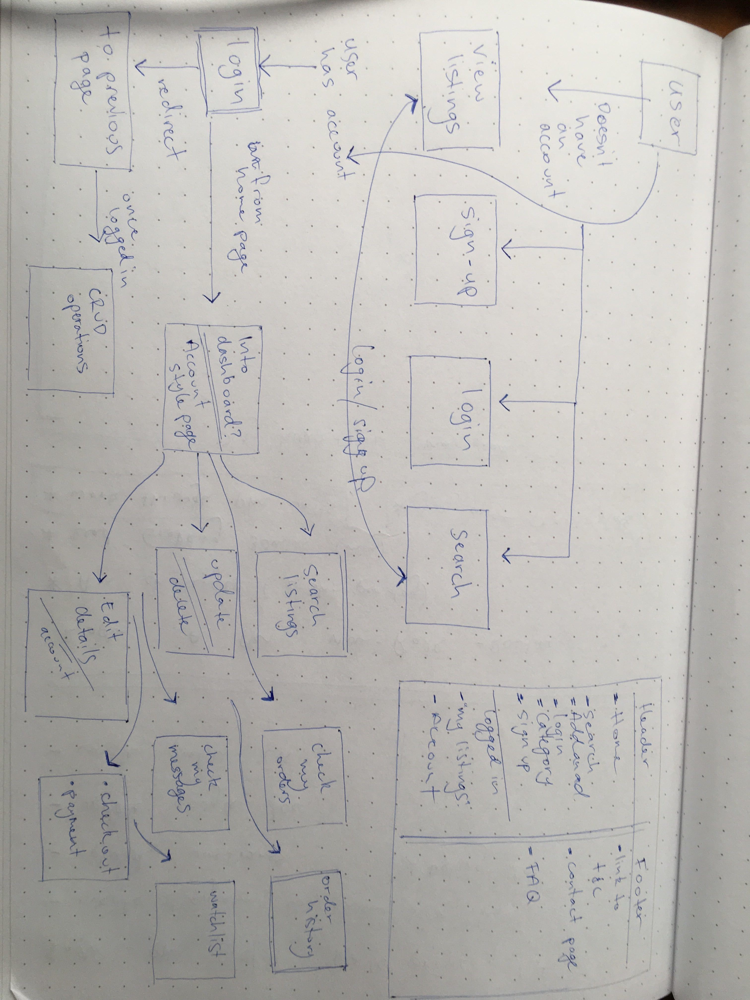
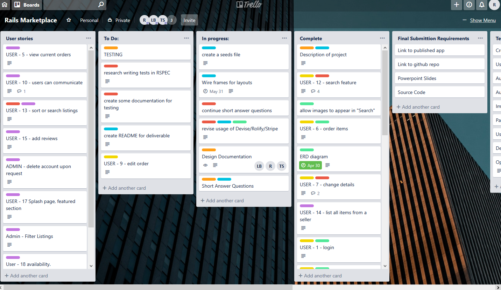
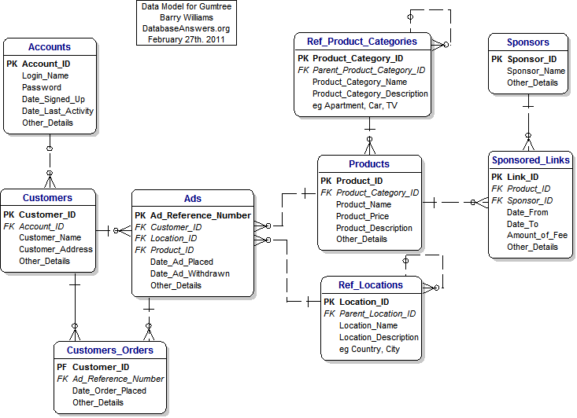
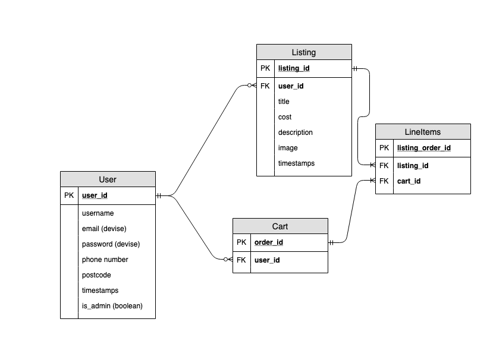

#Event Spark 

#### Link to Heroku 
https://limitless-bastion-71589.herokuapp.com/users/sign_in
#### Link to github repo 
https://github.com/totallynotleo/marketplacev2

A two-sided marketplace to buy and sell secondhand vinyl records.

[Presentation](http://slides.com/juliaryan/long-play-records/fullscreen)

## Table of Contents
- [About the project](#about-the-project)
  - [Problem](#problem)
  - [Solution](#solution)
  - [Functionality](#functionality)
  - [Tech Stack](#tech-stack)
  - [Setup](#setup)

- [Design](#design)
  -[design process](#design-process)
  - [Users Journey](#users-journey)
  - [Trello](#Trello)
- [Short Answer Questions](#short-answer-questions)
- [Future developments](#future-developments)

## About the project
The base for this project is to create a two sided marketplace using Rails

### Problem
The currently exists a entry barrier for amateurs and budding professionals in the entertainment and music industry. High end audio visual equipment used for live shows, theatre production, recording sessions, live sound mixing is often prohibitively priced or 'locked' down to a particular studio or venue. Not to mention the need for equipment for emergency replacement or for touring musicians to be able to rent cumbersome/large pieces of gear without having to pay for transporting it across half the world. While this equipment already exists for hire in the industry it is often down to specialist companies with expensive overheads. 

### Solution
Enter Event Spark! This is a space we've created to connect collectors, professionals, businesses, engineers and basically anyone who has an interest in the entertainment industry. the idea being that often their is gold mines of equipment in private collections that people are eager to see put to use. Event Spark encourages a collective interest in assisting and growing this industry through helping provide access to high end equipment. We forsee the disruption possible here that it allows use of professional grade equipment to those in the industry perhaps just starting or already building a professional portfolio.  

### Functionality
A two sided marketplace that will allows to do the following 

- browse the listings of the site without an account 
- create an account/login to the site with the intention of buying or selling
- search for items based on user selected keywords
- make a payment/receive payment for hiring equipment the user has selected
- create a listing of gear for hire including images 
- once a listing is created it can also be deleted 

### Tech Stack 
The base technologies for Event Spark are..
- Rails framework for Ruby 
- HTML
- CSS
- Heroku
- PostgresQL
- Cloudinary
- Stripe

Along with these technologies gems the following gems were utilized to provide authentication, security of keys and testing.
- Devise
- Dotenv
- RSpec

### Setup

## Design

### Design Process 

The design process was relatively simple as we knew the MVP section of the code would take full precedence over an icing style elements in the front end. The design was to brainstormed and documented via google docs and pen & paper on the first day to guide us a guide to work from in the coming days. It was decided that a simple marketplace to to provide a space for renting A/V equipment provided ample inspiration to work from. 

From here we then elaborated on how we might provide such a service by looking into the designs, layouts and features of existing marketplaces that similarly represented our proposed idea. At this point we needed to model data, begin to wireframe and then structure user stories.The team then broke off into solo work to then follow each of these leads into how we would successfully implement the final product. 

Before we wrote any code we made sure our data models were going to work without complication. 

#### Future development 

The base sections of the code didn't feature all of the user stories due to lack of time and the desire to avoid feature creep. Anything not considered MVP was sidelined. Some of these features included, search by category, review systems, admin rights to filter listings, in-app messaging service, email notification for users based on selected criteria, calendar based booking system.

#### Users Journey

An outline of a users journey can been see in the diagram below. The basic journey would be that from landing page users can view all aspects of listings without logging in. They can elect to log in straight away, view their profile and navigate to the listings section and either create a listing or place an order, complete a payment then logout of the site. 

#### Trello

Trello was used for project management and to facilitate the an aspect of the collaboration between team members. Cards were allocated in standard fashion with due dates, labelling and use of lists to denote importance to MVP and final deliverables. 

## Short Answer Questions
#### 1. What is the need (i.e. challenge) that you will be addressing in your project?

The problem we have identified to be addressed is allowing performers, venues, new artists or amateurs in the entertainment industry to access high end, professional audio visual equipment. The often high price of event lighting, amplification, recording and mixing equipment means that those without large backing but a desire to produce impactful, memorable and professional performances may not have access to this equipment. It also addresses a challenge to touring musicians/performers through wider scale online access to gear for hire. 

#### 2. Identify the problem you’re trying to solve by building this particular marketplace App? Why is it a problem that needs solving?

 The problem we are addressing is that we want performers of all levels to be able to access high end equipment. On the other side of this we want to provide a opportunity to collectors, studios, and other vendors either individuals or collectives to allow equipment to earn them income by hiring out to people with common interest. I also gives users access vintage or collectors items that may be unavailable in the traditional retail marketplace or prohibitively priced.
 
 Another vector of disruption that is being addressed is that it provides venues access to equipment for travelling performers. It also provides an avenue to those who wish to use professional grade equipment for one off events without the need for large amounts to begin with. 

#### 3. Describe the project will you be conducting and how. your App will address the needs.

The project is a simple two-sided marketplace, Event Spark, to allow people to create an account and through this account either list equipment for hire or browse available equipment for hire. The app will address the afore mentioned issues via a simple to use platform provided a secure way to list equipment and then make or receive payment for good rendered through Event Spark. 

#### 4. Describe the network infrastructure the App may be based on. 
The underlying network infrastructure being used here is linked to the Rails framework and Heroku as the hosting platform. 

The Rails framework uses the Puma webserver to provide a fast concurrent HTTP server. 

Heroku uses VM's named Dynos to run the application as a container holding all of dependencies. Despite the shared nature of the hosting, Dynos are isolated from each other. This allows a barrier against fault cascades. Another benefit of using this method of hosting is the scalability it provides through use of containers in this manner. Allowing for higher numbers of requests to be made against multiple instances of the app running inside a Dyno.

#### 5. Identify and describe the software to be used in your App.

software utilized in Event Spark 
- Ruby on Rails as the server side language to create underlying code the MVC architecture will run on
- PostgresQL provides the database for the app, Postgres allows the app to be deployed directly to Heroku 
- Front End is created using HTML5 and CSS3, allowing for a responsive and captivating design to each of the user views
- Image hosting is made possible through the use of the cloud service and CDN Cloudinary
- Stripe allows for payment handling in a secure offloaded way
- Github is used for collaborative working and version control
- Heroku provides hosting and allows an automated deployment as well as packages dependency

#### 6. Identify the database to be used in your App and provide a justification for your choice.

Postgresql will be used as the database in Event Spark as it is a relational database that is open source and ACID (Atomicity, Consistency, Isolation, Durability).

The open source nature gives Postgres a huge developer support base and means there is a level of transparency that gives a level of trust. This itself also allows for a wide level third party support. Postgres also provides a level of customization in terms of data and index types. Although this feature won't be of particular use at this stage of the project it's better to bear this in mind now rather than make a switch later based on our needs. 

The normalized relational model of our data give another justification to use Postgres. Although SQLite is the default Rails database it makes sense to use shift to Postgres as this is the database for deployment to Heroku. Postgres is however not the lightest or performant choice but its benefits and the structure of our data combined with deployment needs made Postgres the sensible choice here. 

#### 7. Identify and describe the production database setup (i.e. postgres instance). 

Postgres will be implemented in a simple way with only two main tables, user and listing and two joining tables, lineitems and cart. In our app we will only have necessity to use the client side of Postgres. The database itself is linked with Heroku deployment through use of the pg gem. At this point the tables are created based on the setup and migrations within the codebase. 

Postgres operates with a client and server application that, as a database, allows users to creation tables for the the storage and querying of data handled by the linked application running postgres. 

These two main tables are the only two required under our MVP section and careful consideration was made through several re-designs of the pre-production database to ensure there were as few complex relations as possible. The tables have been selected to represent a normalized relationships. In future iterations there should be extensibility of the database without a drastic or damaging restructure. Each user has essential fields that provide for the link between a user making a listing and a subsequent user making an order against this listing. This relationship is made through the cart joining table. Other users can also be made admin through a rails console command which allows them further access. 

#### 8. Describe the architecture of your App.

Our app is structured using the MVC paradigm to allow a fairly simple interface between one type of user and the other, namely buyer and seller in simple terms. In a physical sense we are providing the 'marketplace' for these users to meet and conduct commerce. The MVC design in Rails allows much of the creation of the Models, Views and Controllers to be handled in the Rails 'magic' way. This means from concept to deployment can be streamlined as possible. 

We have our models portion of code handling the logic side of the carts, the line item table, the listings and users. Logic implemented here allows users to add items to the cart and view a total price along with the validation side of the data being implemented through application record. Devise is also handling user validation in the user model. 

Views are relatively rudimentary for an app this size scale but here we are routing the users around the platform and thus render the view determined by the user action. Here we are allowing users to
- to be able to login
- view listings
- view their account info
- search for listings
- handle the redirect to Stripe for payment 
- show success or failure for various actions
- logout 
- navigate back to home if required 

Controllers are acting as a switchboard of sorts and in our app they being used to handle user made requests to either the database or to render a new view based on the action made. 

The basic premise this architecture is following is the separation of concerns to allow things to be as modular as possible. 

#### 9. Explain the different high-level components (abstractions) in your App.

The high level components of our app follow the MVC design and are 
- models to handle logic side of the app 
    - User, listing, line_item, cart and application record
- Views are for rendering the HTML side of the site and allow users to make the necessary requests to utilize the app in full
    - they are broken up into carts, layouts, line items, listings and users and then further views are implemented inside this 
- controllers are being used in the customary fashion here to handle and pass the request between model and view
    - controllers handle the requests and routing between users, listings, line items and carts

#### 10. Detail any third party services that your App will use.

*Heroku* 
- The app will be deployed to Heroku and hosted here for future use. As Heroku is a fully managed container based hosting platform it allows us to focus on production of the product without the headaches associated with managing hardware, servers and associated infrastructure.
*Cloundinary*
- image uploads will be handled Cloundinary, the benefit of this for future iterations of this app and current versions is Cloundinary being a CDN as well as a cloud based image hosting service. This allow for faster content delivery across networks through localized server storage of images. This is an essential feature now as we approach we know we have limited time to garner user attention before they close a tab or decide things are happening to slowly.
*Stripe* 
 -Stripe will handle the payment aspect of the site. A key aspect of this is the payment security is then offloaded to Stripe and details are never touched by Event Spark to ensure a further layer of security. 
*Github* 
- Github is used for version control. Obviously an essential element in software development is the use of version control to ensure, as much as possible, wrinkles in the code are ironed out before deployment and not pushed to production code. 

#### 11. Describe (in general terms) the data structure of marketplace apps that are similar to your own (e.g. eBay, Airbnb).

As a two sided marketplace serving sellers and buyers as a platform in this manner we have ample to compare, here we take a look at the Gumtree data model. Notable differences are the presence of a location table and sponsors and sponsored links as being related to the products. A future iteration of the Event Spark app will likely inclulde a table for category similar to the model shown below. At a basic level a two sided marketplace will be fairly similar to these data structures in many ways due to the recurring similarities between them. 

One notable similarity here is that users can both buy and sell thus the joining table between users and ads. 

*gumtree data model*

#### 12. Discuss the database relations to be implemented.

Due to the nature of this marketplace the relations to be implemented are quite simple. We have *Users* who can *Listings* and from a listing a *User* 

We have elected to allow and select the following relationships

    - Users have a relation of a mandatory to zero or many relationship in the Listings table
    - Listings are connected to the User by use of a joining table of Line Items which itself is connected to the Cart    table in a one and ony one in a one or many relation

In essence the tables in our app represent the two sides of the marketplace, a user who can buy or sell items to other users. This flow follows a relation of user may have zero or many listings and users may buy one or many listings, linked back to the buyer and seller through the joining tables. 

We elected to avoid many to many relations to avoid unnecessary complications. 

#### 13. Describe your project’s models in terms of the relationships (active record associations) they have with each other.

Our active record associations are mainly between the two main tables, Users and Listings which can be described as being
*User* used to hold the id and info of users wishes to make a listing or make an order
- User model has many listings, has many orders
- the user model also handles the authentication 
*Listing* holds the link between the owner of the item 
- Listing belongs to a user
- has many line items 
- has one attached image
*line items* line items are used to link the cart of a buyer to an item 
- belong to a cart
- belong to a listing
*cart* the cart is used to store the line items the user wishes to purchase linking the buyer and seller is the final relation
- has many line items

The relations between these models follows the scheme and can be viewed for more detail in the diagram below. 

#### 14. Provide your database schema design.

The overview of our schema follows our ERD and although the ERD has some revisions along the way the schema also changed to reflect this. 

*final erd*

#### 15. Provide User stories for your App.

These are the potential user stories we decided on, please note full functionality of these stories was implemented based on what was decided as MVP and what was future iteration

*renters stories 
- I want to be able view listings prior to logging in or making an account
- I would like to navigate to a listing to view more details
- I need to create an account and use this account to order a product
- I made a mistake, I want to delete an order prior to payment
- I want to view my order history

*rentees*
- login and view orders 
- make a listing of a new item for others to view
- upload images the item for the listing
- edit my listing 
- I would like to be able to use a calendar to view booked items
- temporarily suspend my account if I will be unable to attend to orders

*both sets of users or admin of the site*
- edit my profile details
- reset my password if I have forgotten 
- search for the listings for particular items  
- users can communicate between each other on an onsite messenger platform 
- create a watch/wish list of items that interest me 
- view reviews of items, renters and rentees
- filter listings based on category
- filter items before they are posted to ensure they meet ethical and legal guidelines, not drugs, no hate speech etc
- to be able to delete a listing if it violates this policy
- delete a user account upon request from the user or if certain policy violations are made

#### 16. Provide Wireframes for your App.

# to be added

#### 17. Describe the way tasks are allocated and tracked in your project.

Early on in the planning phase we allocated out certain sections of the workflow and then created a Trello board to track this allocation. The method we used was allocation of a Trello card label that denoted certain team members. This way tasks could be created or drafted, put into Trello and then the team member could begin to work on this task right away or according to the timeline. It also meant that a task could be allocated while a team member wasn't present but notified via Slack. 

We also allocated tasks based on the relevant experience, passion and expertise to allow for the project to be completed in the most streamlined fashion that we could forsee. 

The first week and a half a running document was kept to draft out concerns and discuss the work sessions. This allowed certain things to be tracked into the days ahead as we could see particular pain point or features that would require research rather than being written straight away.

#### 18. Discuss how Agile methodology is being implemented in your project

Agile methodology was used to plan project sprints to complete the crucial sections of MVP code, design process, brainstorming, wireframing, documentation, testing, layout and design of the live site, deployment. A running diary was kept of work sessions for all members to view in the case of absence. This also allowed work to be carried out independently or in pairs as required. As in all things some parts of the project sprints extended past the envisaged timeline but this was handled but task shifting and load sharing. 

Another aspect decided on early was that each member has different time constraints and we would need to work independently outside of allocated class hours. This meant frequent communication via slack, monitoring and notifying members of changes via slack and trello as well as check ins during time spent while working together to ensure all any issues were raised and could be rectified. Despite this most work was completed when members were in class during loosely planned sprints. 

Our timeline loosely followed
- day 1 brainstorm idea, plan out the erd, troubleshoot issues with before writing any code
- day 2 complete erd diagrams, plan the mvp sections of code, research other marketplaces, revise the use of gems that are required for the project.
- day 3 was a futher planning sessions that included erd modification, ethical concerns discussed, further user stories adedd and the users journey
- day 4 was a beginning of the initial codebase while other members began to create supporting documents needed and finalise research to ensure all bases were covered regarding features
- day 5 was creation of basic rails app and discussion/coding of models for db relations as well as wireframing
- day 6 was a further session that was MVP coding, documenting and a brief session to discuss any issues that were present
- day 7 testing of gems, adding of search feature, further documentation and work on the deliverables aspect
- the remaining days were broken up due to the members having some commitments that cut into face to face time as a team however the aspects worked on were adding to cart section, stripe, and the layout aspect of the views along

all of the coding was done using frequent commits and testing of code as these stages to ensure no bugs were being introduced to production code. 

#### 19. Provide an overview and description of your Source control process.

We adapted a feature branch workflow for source control with a single repo maintainer. This allowed for independent coding of features without touching the production code. Features were worked on in sprints on separate branches before being tested, final origin pulls to ensure up to date code and merge conflicts were avoided and raised as a pull request to the repo maintainer.

#### 20. Provide an overview and description of your Testing process.

Testing was done in a number of ways, one was bug chasing via the user journeys to ensure all features worked as expected and that unexpected cases were taken into consideration. Further unit testing was undertaken using RSpec to ensure the routs, models, views and controllers were exhibiting expected behaviors. The team was relatively inexperienced using unit testing and so more exhaustive testing will be conducted in the future. 

A portion of the tests conducted were
- users can login in and view account 
- users can make an order
- users can make payment for an order
- users can delete an item from the cart
- users can logout 
- users can create a listing 
- users can modify a listing or upload a photo
- users cannot add their own listing to an order

#### 21. Discuss and analyse requirements related to information system security.

The Rail framework itself is a relatively secure platform to work in as the built in helper methods can help defeat injection attacks. Forms are another common avenue for malicious intent and to the teams knowledge at this stage Rails is using encrypted cookies to protect sessions. Data is also validated using authenticity tokens by Rails prior to being written into the database for further security.

Use of third party services allowed a layer of abstraction for further security beyond the Rails framework. Devise is internally using the Bcrypt gem to encrypt passwords so passwords aren't being stored as plain text (cough-facebook-cough). Stripe gives a layer of security to the payment site of things by allowing the platform to offload payment details, thus credit card info is never stored or handled by the app itself. 

Another aspect of security is the storing of data in the database. At this stage we do not take sensitive data from the users beyond an email and phone number and postcode. 

#### 22. Discuss methods you will use to protect information and data.

To protect user data we have ensured that we do not take sensitive data from the user in the first place. We are not asking for names and addresses at account creation or at some other point in the process of the users. Users can elect to have an item shipped however this is discretionary to the user and as the app is providing a service users buying and selling a product. Beyond this however is the protection of users themselves when using the app. Users are prevented from viewing other users data on the platform. We have also ensured users can edit their own data at any point with the request to delete an account to be included in future versions. 

As this app is based scoped to an Australian market at this point we have not deeply considered the breach and storage policy of the GDPR. Further to this as we are using third parties we need to be on guard against breaches or exploits in these cases. Stripe has their own comprehensive security guidelines to ensure safety of their users. Heroku also implements data protection and the use of SLL protocol provides a level of protection during communication with the server. 

Another aspect of this will be to provide a privacy policy for our users ensuring that we are not releasing an part of their details to a third party for purposes other than making a payment. 

#### 23. Research what your legal obligations are in relation to handling user data.

As the app is collecting user data we are obliged to ensure that we comply with the Privacy Act under Australian law. However at this stage the data we received is not utilized for tracking. This is an important consideration and further to this we have ensured we are not collecting sensitive data such as names, addresses and phone numbers that may be used to track or identify users of our site. Even so a privacy policy will be drafted and provided to users upon sign up to ensure they are aware of what details will be entered and what they are used for. In our case it basically means that we only use the data we have for the time we need it, we are not collecting sensitive or personal data, we are not selling data to any third parties. 

In short we are required to comply with the Privacy Act through a systematic approach to collecting data and considering the impact of a breach of said data, whether this data is sensitive and can be used to identify a user of the platform and if this is the case then the data needs to be encrypted and stored in a secure manner.  

